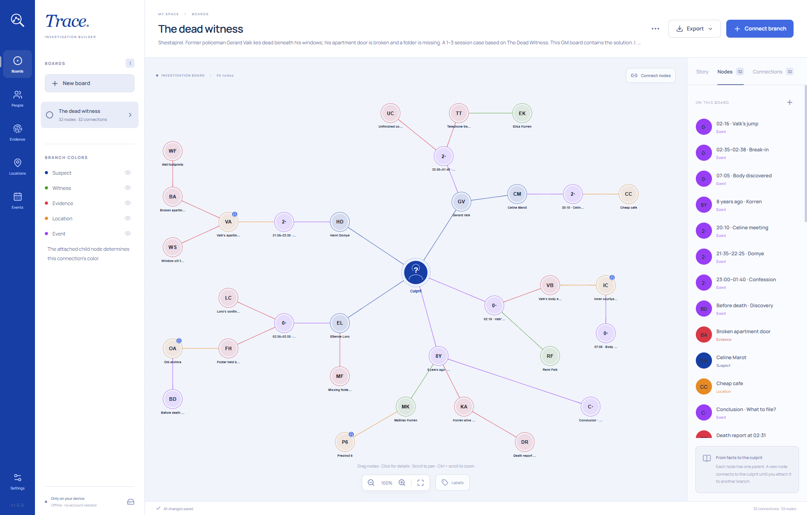
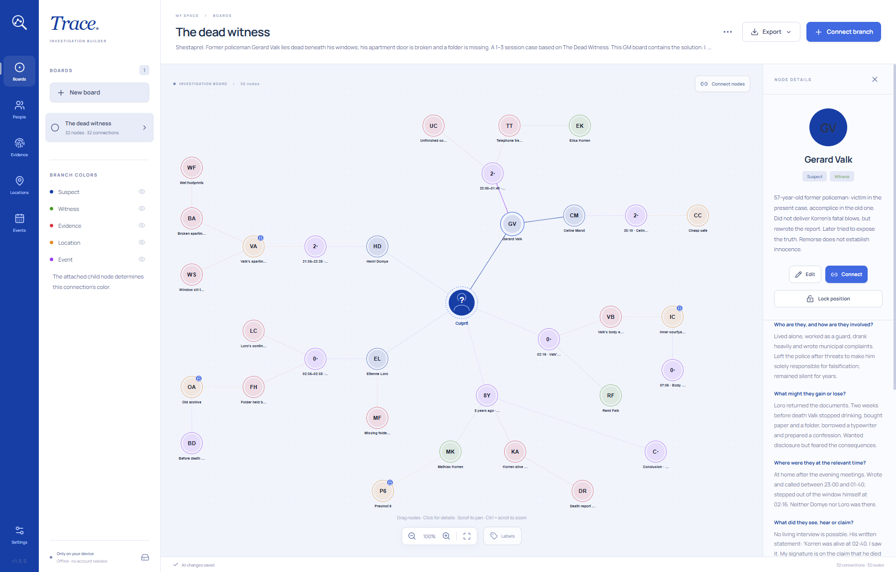
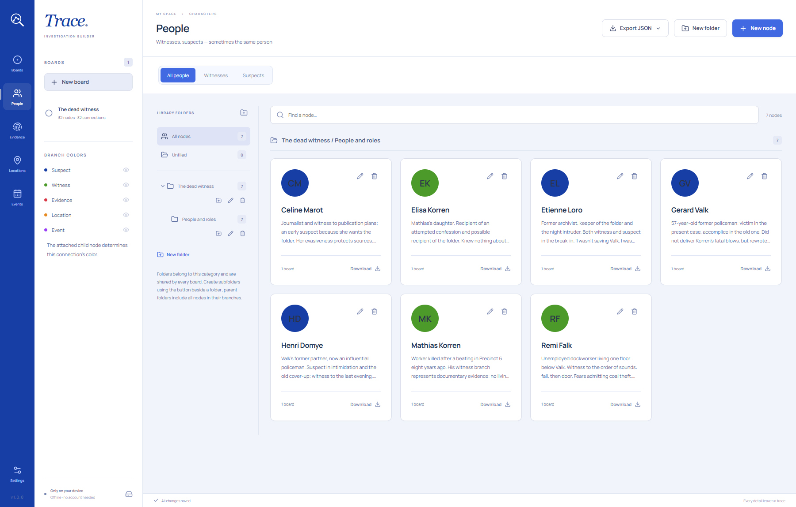
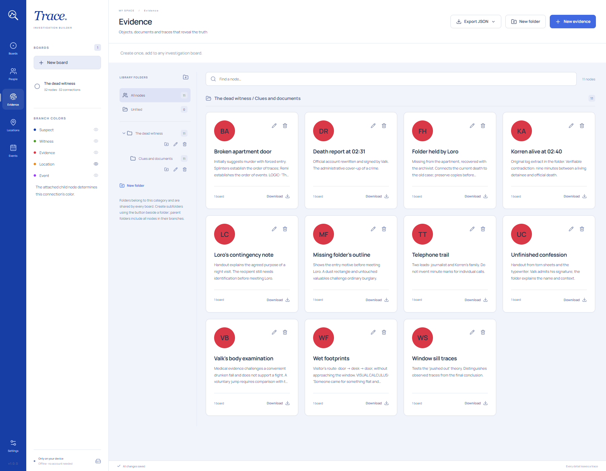
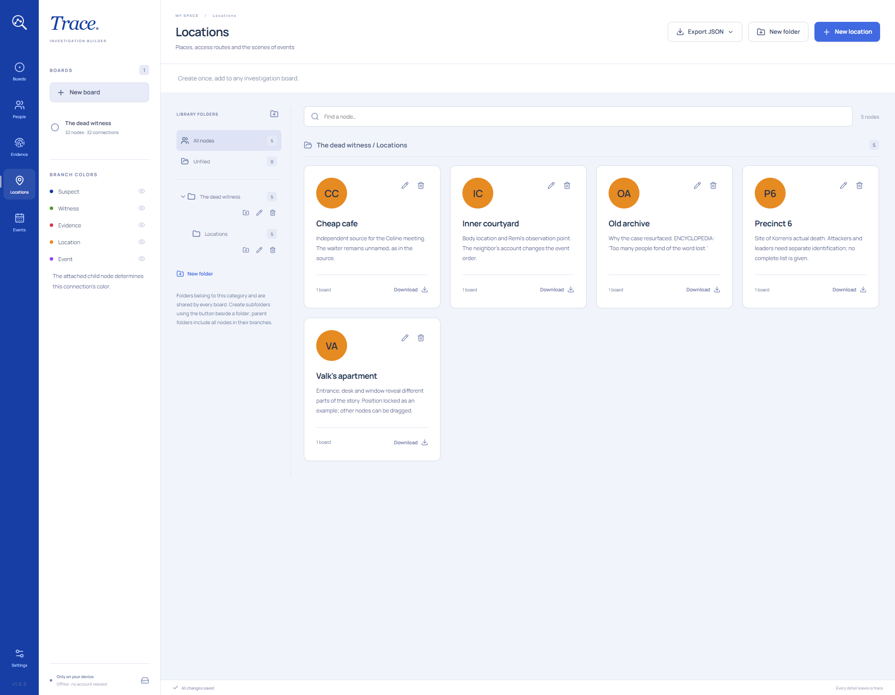
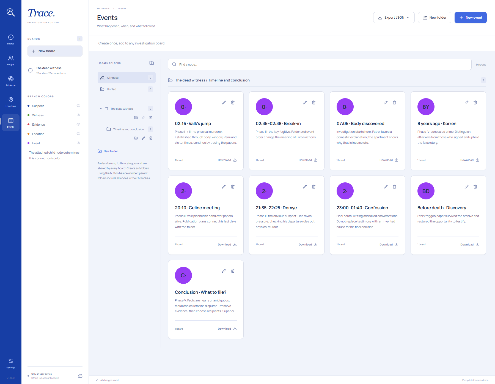
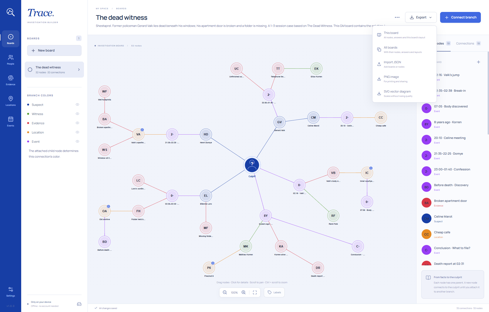

# Trace

**Every detail leaves a trace.**

Trace turns the pieces of a mystery into a visual map of an investigation. Keep suspects, testimony, evidence and
unanswered questions in view as you write your next chapter or prepare a tabletop session.

[**Download Trace from Releases**](https://github.com/spechurkin/trace/releases) · [На русском](README.ru.md)

## A whole investigation, one clear picture

Each board is a space for a case, a mystery or a chapter of your campaign. Place people, evidence, locations and events
around the unknown **Culprit** and connect them into branches. A suspect leads to a meeting, a meeting to a place, a
place to a clue: the board keeps the trail in view.

Move cards freely, zoom in on a lead and lock positions when you want the arrangement to stay put. Colors distinguish
the branches automatically: suspects are blue, witnesses green, evidence red, locations orange and events purple.

## Follow a person's side of the story

Select a person to highlight their connections and bring their notes and answers into view. Who had a motive? Where
were they that night? What supports or contradicts their account? Guiding questions keep the details beside the map
while
you work. A person can be both a witness and a suspect when their part in the case is complicated.

## Build a library you can return to

Give each person a portrait and notes, and add pictures of objects or scenes to your evidence and locations. You can
also start with names and colored initials. Crop, zoom, rotate and flip images to get the look you want.

Your library travels across your boards: create an entry once, then bring it into another case, chapter or campaign.
Shared notes, images and answers stay consistent, while each board keeps its own layout and branches. Separate sections
for people, evidence, locations and events, role filters and nested folders keep the materials easy to find.

### Evidence: keep the facts together

Open **Evidence** in the menu on the left and click **New evidence** at the top right. Give the clue a title, then
record
where it was found, who had access to it, what it reveals and which theory it supports or challenges.

### Locations: give each lead a place

Open **Locations** on the left and click **New location** at the top right. Describe where the place is, who could
enter,
what happened there and what traces remain. Add an image and notes to help you return to the scene.

### Events: record what happened and why

Open **Events** on the left and click **New event** at the top right. Record the time, how certain it is, who was
involved,
what led to the event and what changed afterward. Give each important moment its own card.

To bring these materials onto a board, open **Nodes** in its right-hand panel, click **Add from library**, select the
entries and confirm. Then connect them to people or other leads with **Connect branch**.

## Share the picture, keep the case

Export a board as a PNG for your players, notes or a printed handout, or choose SVG for a diagram that stays sharp at
any
size. To continue working elsewhere, export an investigation with its people, evidence, images, answers, branches and
layout included. You can also share individual entries or a whole folder of your materials.

## From an idea to an investigation

1. **Meet your leads.** Add people, evidence, locations and events, with a few notes about what matters.
2. **Ask the right questions.** Record motives, alibis, testimony and the details behind each discovery.
3. **Bring them together.** Create a board, add your cards and connect branches around the unknown culprit.
4. **Explore the case.** Follow a person's connections, compare accounts with evidence and update the board as the
   story grows.

Want to see it in action? Choose **Explore an example** in an empty library to open _The dead witness_, an editable case
about a former policeman, a missing folder and an old secret. This game master's board includes the solution.

## Your investigations, at your pace

Trace works offline, requires no account and keeps your investigations and images on your device. Changes save
automatically, so you can stay with the story. Back up your library whenever you want.

The interface is available in **English and Russian**, with instant switching in Settings. Your names, notes and answers
stay as you wrote them.

[**Give your next mystery a place — download Trace**](https://github.com/spechurkin/trace/releases)
