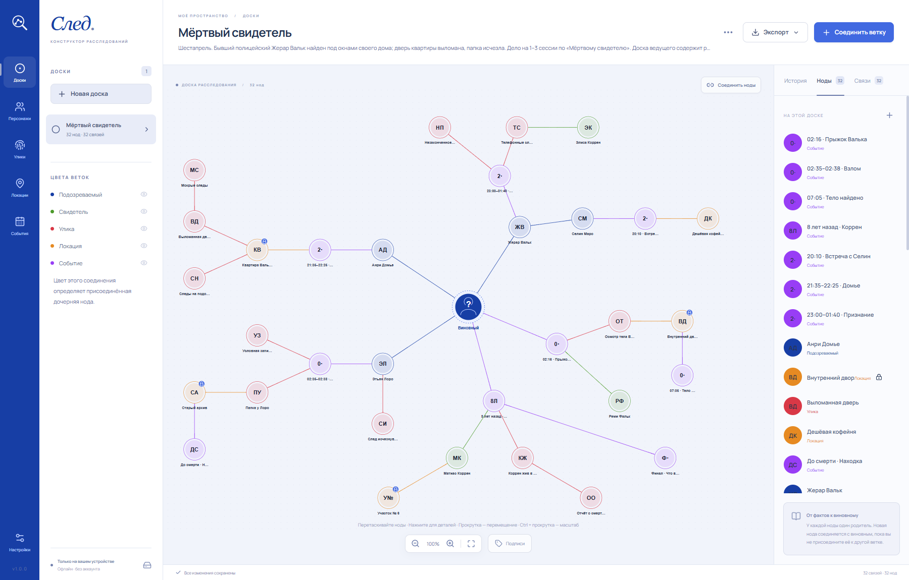
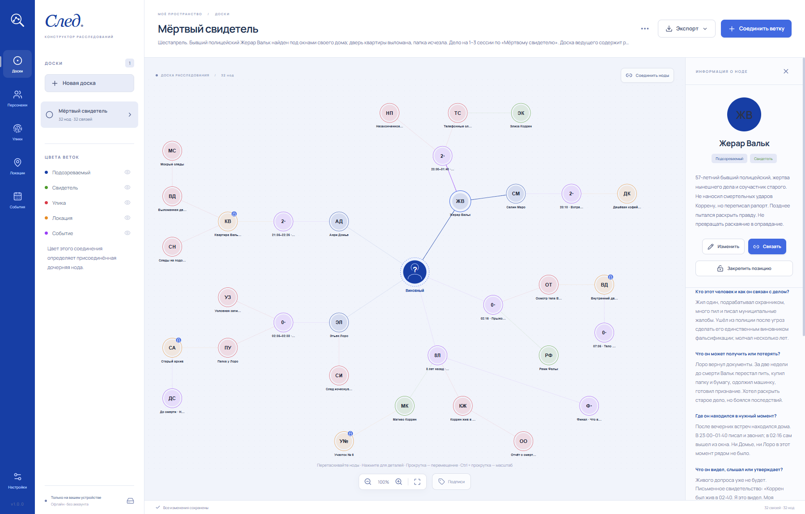
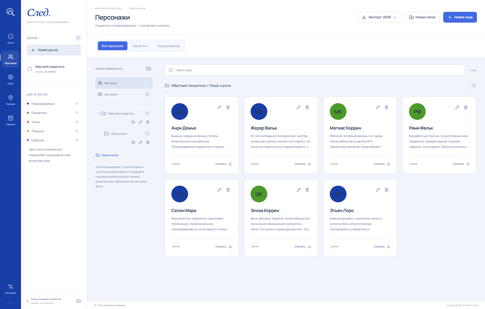
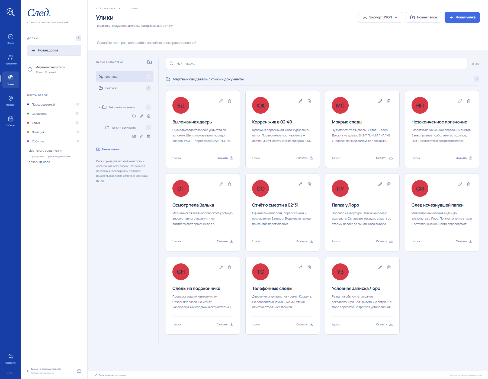
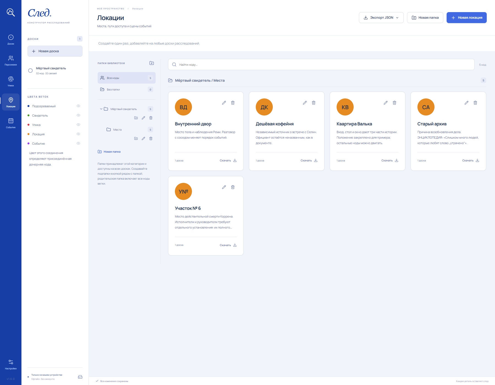
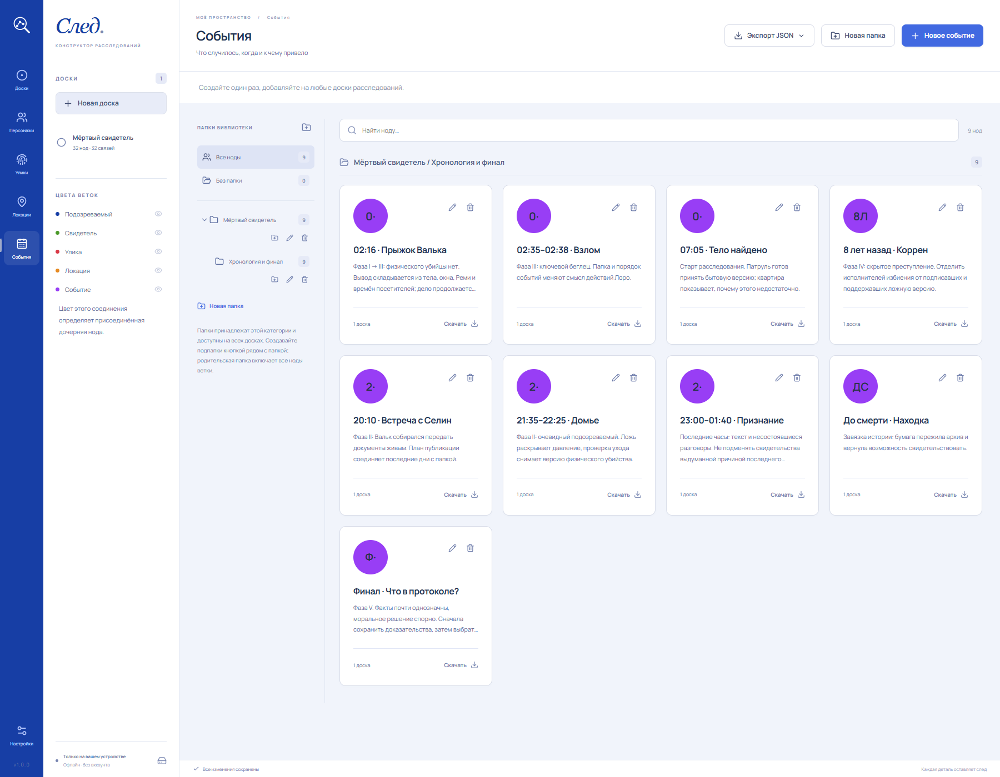
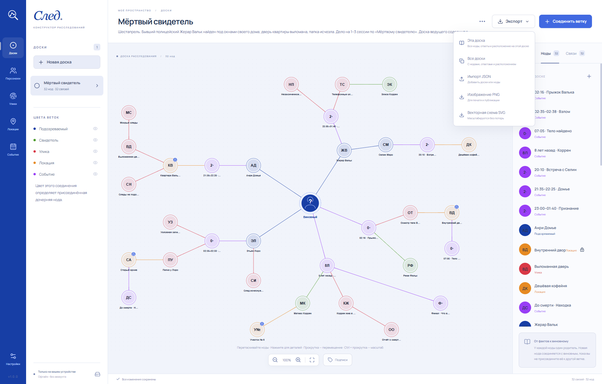

# След

**Каждая деталь оставляет след.**

«След» превращает детали загадки в наглядную карту расследования. Подозреваемые, показания, улики и вопросы без ответа
остаются перед глазами, пока вы пишете новую главу или готовите сессию настольной ролевой игры.

[**Скачать След из релизов**](https://github.com/spechurkin/trace/releases) · [English](README.md)

## Всё расследование — одна понятная картина

Каждая доска — пространство для отдельного дела, загадки или главы кампании. Разместите персонажей, улики, локации и
события вокруг неизвестного **Виновного** и соедините их в ветки. Подозреваемый ведёт к встрече, встреча — к месту,
место — к улике: доска помогает держать перед глазами весь путь.

Свободно перемещайте карточки, приближайте отдельную зацепку и закрепляйте позиции, когда хотите сохранить
расположение. Цвета веток назначаются автоматически: подозреваемые обозначены синим, свидетели — зелёным, улики —
красным, локации — оранжевым, события — фиолетовым.

## Посмотрите на дело глазами персонажа

Выберите персонажа, чтобы выделить его связи и открыть заметки и ответы. У кого был мотив? Где он находился той ночью?
Что подтверждает его слова, а что им противоречит? Наводящие вопросы держат детали рядом со схемой, пока вы работаете
над историей. Если роль персонажа в деле неоднозначна, он может быть одновременно свидетелем и подозреваемым.

## Соберите материалы, к которым хочется возвращаться

Добавьте персонажам портреты и заметки, а уликам и локациям — изображения предметов и сцен. Можно также начать с имён и
цветных инициалов. Изображение можно кадрировать, приблизить, повернуть и отразить, чтобы выбрать подходящий вид.

Библиотека общая для всех досок: создайте запись однажды и добавляйте её в новые дела, главы и кампании. Заметки,
изображения и ответы будут одинаковыми, а расположение и ветки — своими на каждой доске. Отдельные разделы для
персонажей, улик, локаций и событий, фильтры по ролям и вложенные папки помогут быстро найти нужные материалы.

### Улики: соберите факты

Откройте **Улики** в меню слева и нажмите **Новая улика** справа сверху. Дайте находке название и запишите, где её
обнаружили, кто имел к ней доступ, что она раскрывает и какую версию подтверждает или опровергает.

### Локации: найдите место каждой зацепке

Откройте **Локации** слева и нажмите **Новая локация** справа сверху. Опишите, где находится место, кто мог туда
попасть,
что там произошло и какие следы остались. Добавьте изображение и заметки, чтобы было проще вернуться к этой сцене.

### События: запишите, что случилось и почему

Откройте **События** слева и нажмите **Новое событие** справа сверху. Укажите время и его точность, участников, причины
и
последствия. Каждому важному моменту можно дать отдельную карточку.

Чтобы перенести материалы на доску, откройте вкладку **Ноды** в правой панели, нажмите **Добавить из библиотеки**,
отметьте нужные записи и подтвердите выбор. Затем свяжите их с персонажами или другими зацепками кнопкой
**Соединить ветку**.

## Поделитесь схемой, сохраните дело

Сохраните доску как PNG для игроков, заметок или печатной памятки. Выберите SVG, если нужна схема, которая остаётся
чёткой при любом увеличении. Чтобы продолжить работу на другом устройстве, экспортируйте расследование вместе с
персонажами, уликами, изображениями, ответами, ветками и расположением карточек. Можно также поделиться отдельной
записью или целой папкой материалов.

## От идеи к расследованию

1. **Познакомьтесь с зацепками.** Добавьте персонажей, улики, локации и события с несколькими заметками о важном.
2. **Задайте нужные вопросы.** Запишите мотивы, алиби, показания и обстоятельства каждой находки.
3. **Соберите их вместе.** Создайте доску, добавьте карточки и соедините ветки вокруг неизвестного виновного.
4. **Исследуйте дело.** Следуйте по связям персонажа, сопоставляйте показания с уликами и меняйте доску по мере развития
   истории.

Для первого знакомства нажмите **Посмотреть на примере** в пустой библиотеке. Откроется «Мёртвый свидетель» —
редактируемое дело о бывшем полицейском, пропавшей папке и старой тайне. Эта доска ведущего содержит развязку.

## Ваши расследования в вашем ритме

«След» работает офлайн, не требует аккаунта и хранит расследования и изображения на вашем устройстве. Изменения
сохраняются автоматически, чтобы вы могли сосредоточиться на сюжете. Резервную копию библиотеки можно сделать в любой
момент.

Интерфейс доступен на **английском и русском** и переключается сразу в настройках. Имена, заметки и ответы остаются
такими, какими вы их написали.

[**Дайте следующей загадке своё место — скачайте След**](https://github.com/spechurkin/trace/releases)
